# Smart Home Alarm

A local smart home alarm built with Raspberry Pi Zero WH, featuring PIR motion detection, LED and buzzer alarm feedback, Zigbee/MQTT door monitoring, camera support, a web dashboard and custom PCB design.

---

# Development
This project was developed as a group project in Electrical Engineering.

Contributors:
- [neez11]
- [abbefakih]
- [MarcusAtaseven]

---

## Overview

This project is a smart home alarm prototype designed to run **locally without cloud services**.  
It combines embedded hardware, wireless communication, backend logic, a web-based dashboard, PCB design, and a 3D-printed enclosure into one complete system.

The system is built around a **Raspberry Pi Zero WH** and can:

- detect motion using a PIR sensor
- detect door/window events using a Zigbee sensor
- trigger local alarm feedback using LED and buzzer
- log events in the backend
- show live status in a web dashboard
- display a camera feed during alarm events
- run locally without relying on external cloud platforms

---

## Final Product

### Final assembled product
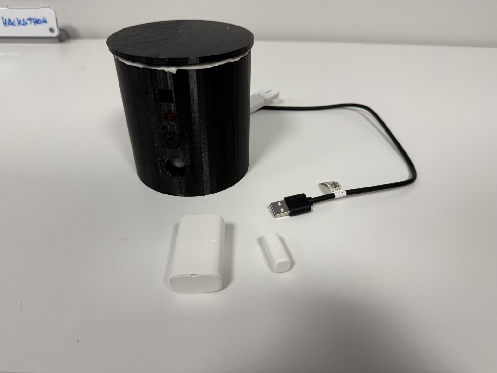

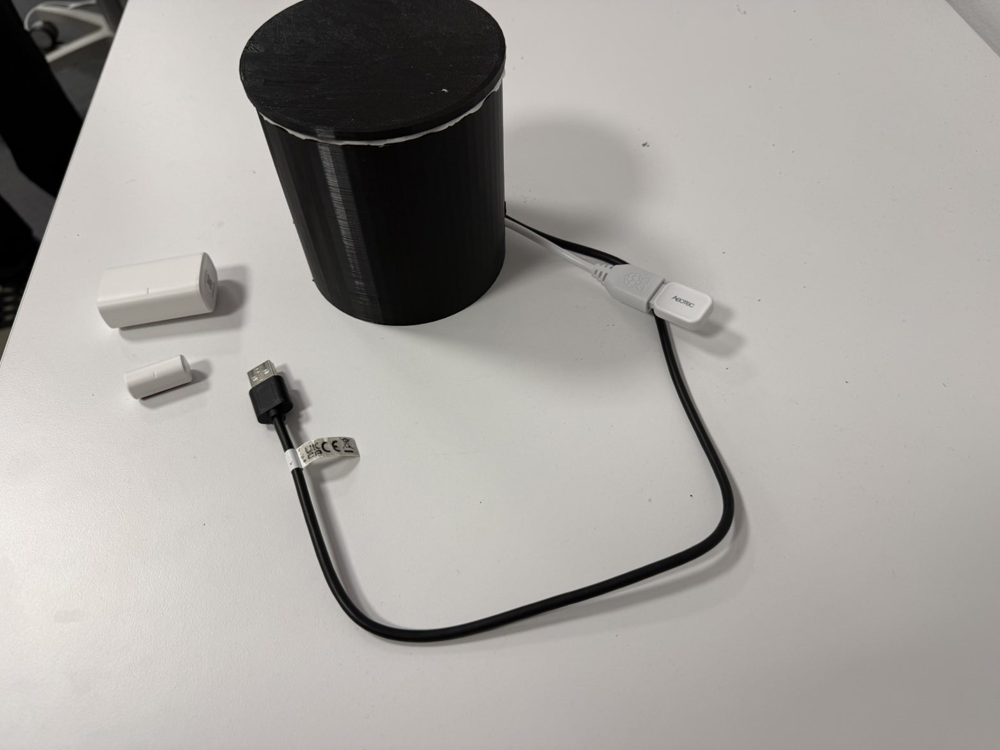

---

## Hardware Components

- Raspberry Pi Zero WH
- PIR sensor
- LED
- buzzer
- 220 Ω resistors
- SONOFF SNZB-04P Zigbee door/window sensor
- Zigbee USB adapter
- micro-USB OTG adapter
- Raspberry Pi camera module
- custom PCB
- 3D-printed enclosure

---

## System Architecture

The project is divided into the following parts:

### Local Hardware
- PIR sensor
- LED
- buzzer
- Raspberry Pi GPIO connections
- custom PCB

### Wireless Sensor Layer
- Zigbee door/window sensor
- Zigbee USB gateway
- Zigbee2MQTT
- MQTT messaging

### Software
- Python backend
- alarm logic
- event logging
- camera service
- REST API

### User Interface
- React/Vite frontend
- live system status
- event timeline
- control buttons
- camera view

### Deployment
- local hosting on Raspberry Pi
- Nginx as web server / reverse proxy

---

## Hardware Prototype

### Prototype wiring and components
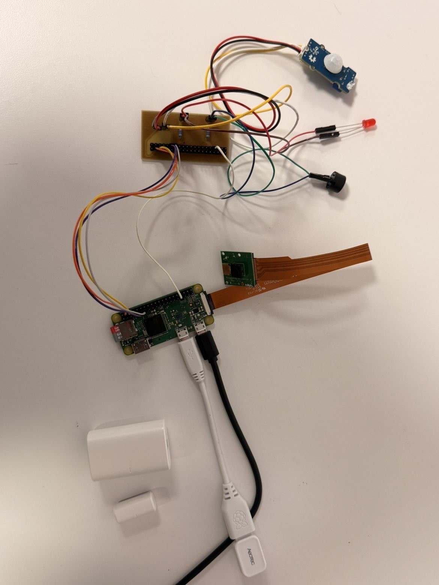

### Raspberry Pi GPIO reference
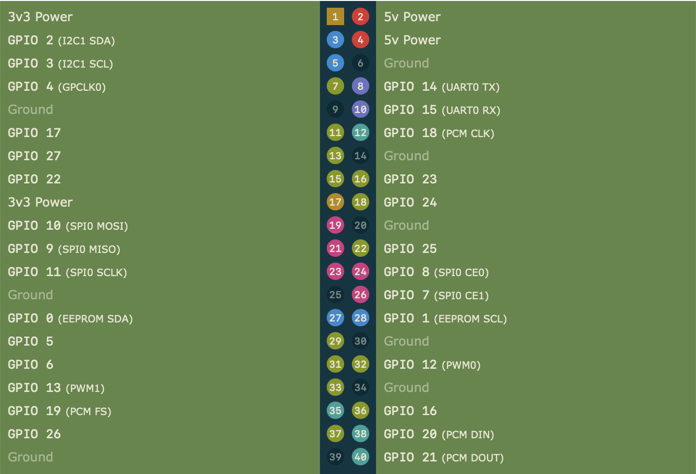

---

## Schematic and PCB Design

The PCB was designed in **KiCad** based on the local hardware part of the system.

### KiCad schematic
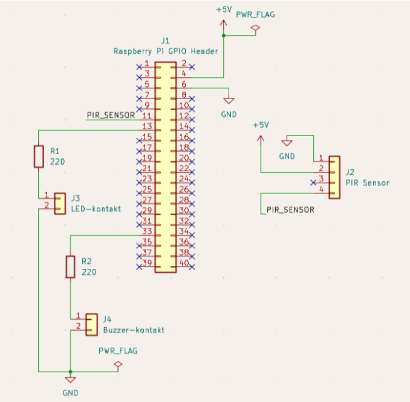

### PCB layout
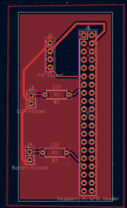

### Manufactured PCB
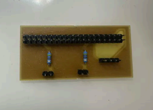

The PCB includes the local electronics for:

- Raspberry Pi header
- PIR sensor connection
- LED connection
- buzzer connection
- resistors

The camera and Zigbee door sensor are handled separately and are not mounted directly on the PCB.

---

## 3D Enclosure Design

A custom enclosure was designed to make the prototype more compact and easier to demonstrate.

### Enclosure lid CAD
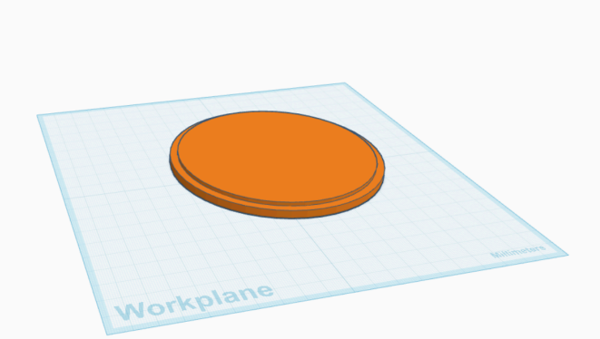

### Main enclosure CAD
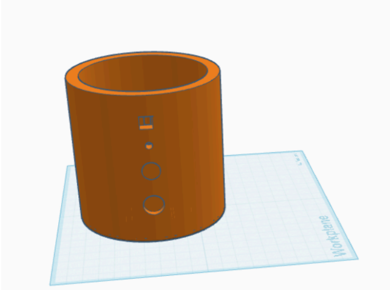

---

## How the System Works

1. The Raspberry Pi continuously monitors the PIR sensor and listens for door sensor events.
2. If motion is detected or the door opens while the system is armed:
   - the alarm state is triggered
   - LED and buzzer are activated
   - the event is logged
   - the web dashboard updates automatically
   - the camera can be used for visual verification
3. The user can monitor and control the system through the local web interface.

---

## Network Communication

The door/window sensor is not connected directly to the GPIO pins.  
Instead, it communicates wirelessly over **Zigbee**.

The communication flow is:

`Door Sensor -> Zigbee -> Zigbee USB Adapter -> Zigbee2MQTT -> MQTT -> Python Backend -> Frontend`

The PIR sensor, LED, and buzzer are connected locally to the Raspberry Pi.

---

## Web Dashboard

The web interface is used to monitor and control the system in real time.

It shows:

- alarm status
- motion status
- door status
- LED status
- buzzer status
- camera status
- event log
- control buttons for arm / disarm / reset / test

### Login page
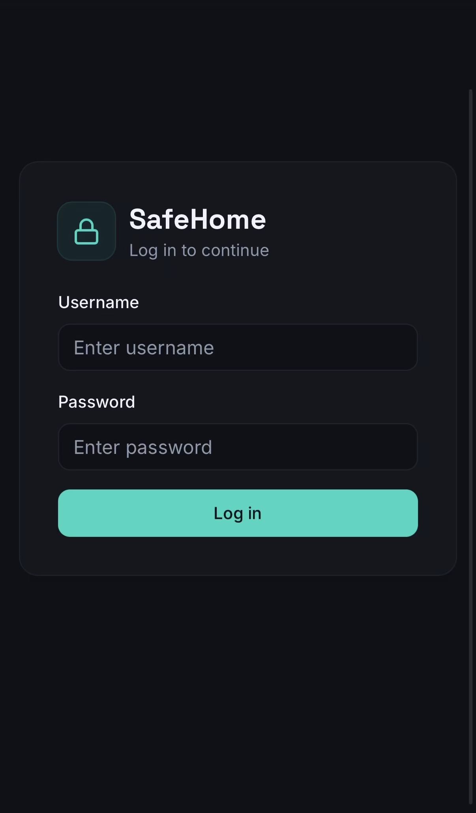

### Dashboard overview
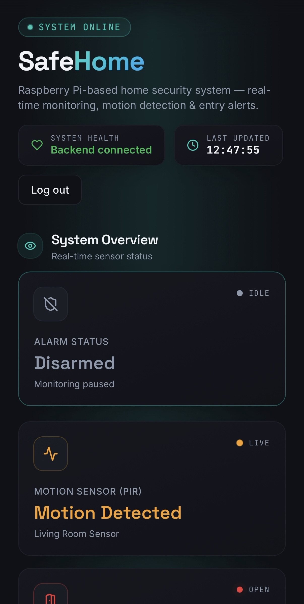

### Control panel and standby camera area
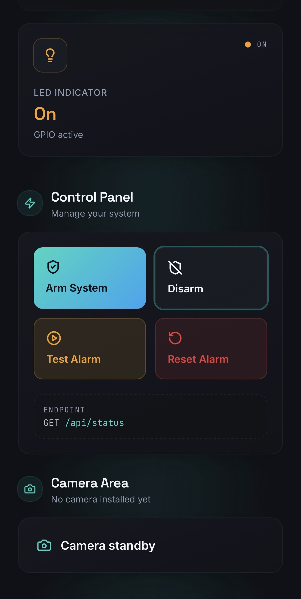

### Alarm camera view
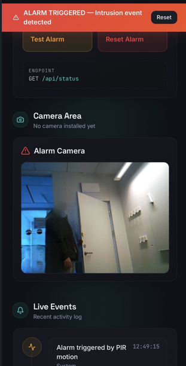

### Live event log
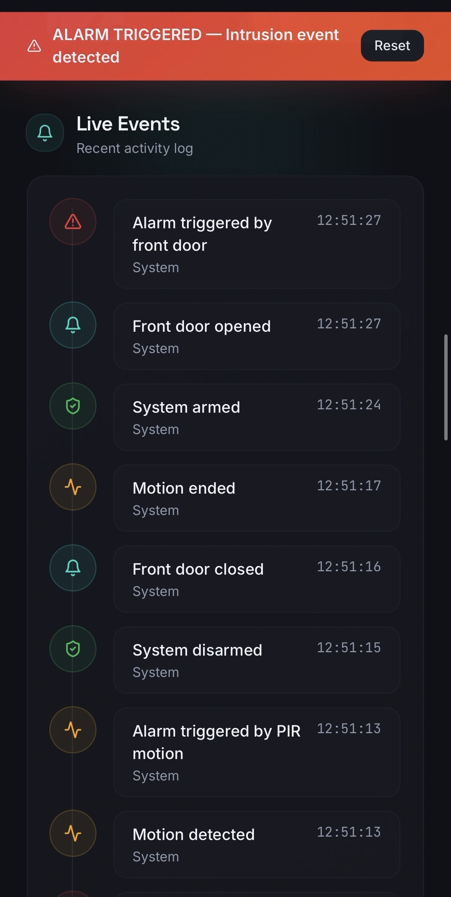

### Hardware status section
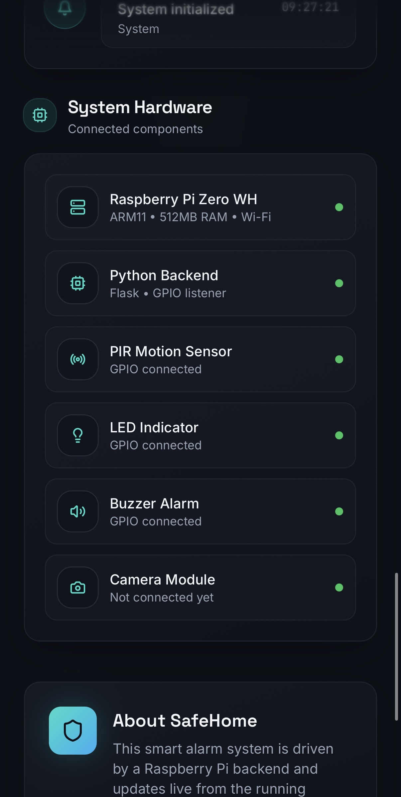

# Project Scope
The system was designed as a local smart home alarm prototype with a focus on practical testing, modular design, and local monitoring without cloud services.
